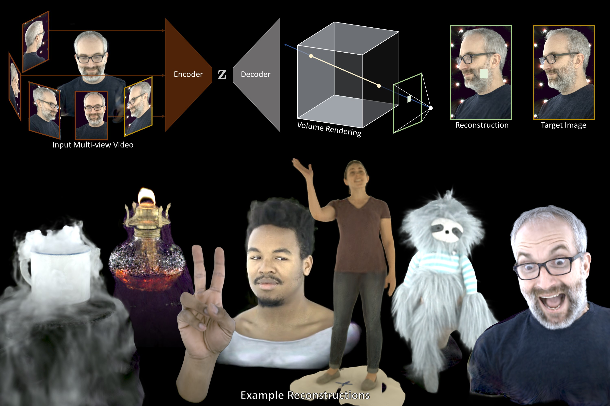

# Neural Volumes

This repository contains training and evaluation code for the paper 
[Neural Volumes](https://arxiv.org/abs/1906.07751) to use [Genebody](https://generalizable-neural-performer.github.io/) and [V-sense](https://v-sense.scss.tcd.ie/news/v-sense-volumetric-video-quality-database/) dataset. The method learns a 3D
volumetric representation of objects & scenes that can be rendered and animated
from only calibrated multi-view video.



## Citing Neural Volumes

If you use Neural Volumes in your research, please cite the [paper](https://arxiv.org/abs/1906.07751):
```
@article{Lombardi:2019,
 author = {Stephen Lombardi and Tomas Simon and Jason Saragih and Gabriel Schwartz and Andreas Lehrmann and Yaser Sheikh},
 title = {Neural Volumes: Learning Dynamic Renderable Volumes from Images},
 journal = {ACM Trans. Graph.},
 issue_date = {July 2019},
 volume = {38},
 number = {4},
 month = jul,
 year = {2019},
 issn = {0730-0301},
 pages = {65:1--65:14},
 articleno = {65},
 numpages = {14},
 url = {http://doi.acm.org/10.1145/3306346.3323020},
 doi = {10.1145/3306346.3323020},
 acmid = {3323020},
 publisher = {ACM},
 address = {New York, NY, USA},
}
```

## File Organization

The root directory contains several subdirectories and files:
```
data/ --- custom PyTorch Dataset classes for loading included data
eval/ --- utilities for evaluation
experiments/ --- location of input data and training and evaluation output
models/ --- PyTorch modules for Neural Volumes
render.py --- main evaluation script
train.py --- main training script
```

## Requirements

* Python (3.6+)
  * PyTorch (1.2+)
  * NumPy
  * Pillow
  * Matplotlib
* ffmpeg (in PATH, needed to render videos)

## How to Use

There are two main scripts in the root directory: train_genebody.py and render_genebody.py. The
scripts take a configuration file for the experiment that defines the dataset
used and the options for the model (e.g., the type of decoder that is used).

Please prepare the 

To train the model:
```
python train.py config_genebody.py
```

To render a video of a trained model:
```
python render_genebody.py config_genebody.py
```

## License

See the LICENSE file for details.
